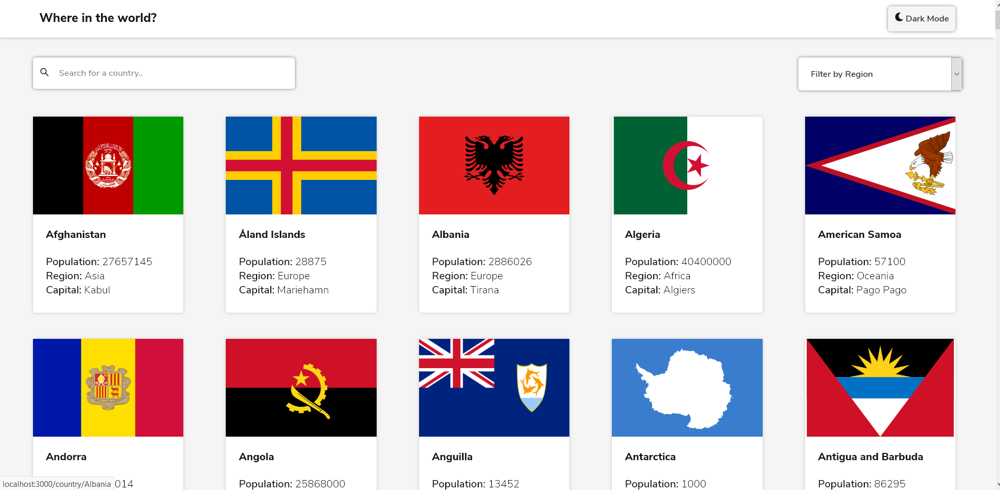

<h1 align="center">A simplified Country Searcher App built with React</h1>

Auto formatted with Prettier

<h3 align="center">
  <a href="https://whereintheworld-react.netlify.app/">Visit the live app</a> |
</h3>

 Libraries Used
  <ul>
    <li>react</li>
    <li>react-router-dom</li>
    <li>styled-components</li>
    <li>react-icons</li>
  </ul>

