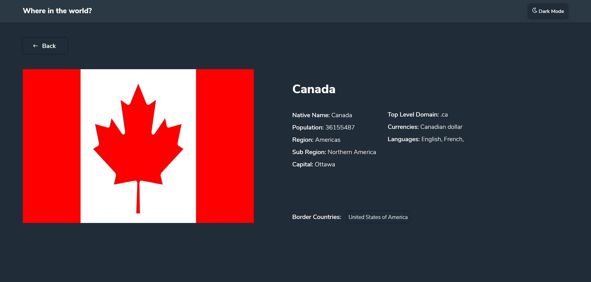

<h1 align="center">A simplified Country Searcher App built with React</h1>

Auto formatted with Prettier

<h3 align="center">
  <a href="https://whereintheworld-react.netlify.app/">Visit the live app</a> |
</h3>

## What is this? A challenge

Your challenge is to integrate with the [REST Countries API](https://restcountries.eu) to pull country data and display it like in the designs.
